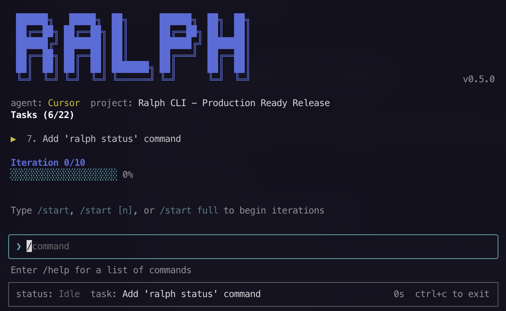

# Ralph

<div align="center">

## A CLI tool for long-running PRD-driven development with AI coding agents

[](https://github.com/nitodeco/ralph)
[](LICENSE)



</div>

Ralph automates the process of working through a Product Requirements Document (PRD) by orchestrating AI coding agents (Cursor or Claude Code) to complete tasks one at a time.

## Installation

Install Ralph with a single command:

```bash
curl -fsSL https://raw.githubusercontent.com/nitodeco/ralph/main/scripts/install.sh | bash
```

## Quick Start

### 1. Initialize a new project

```bash
ralph init
```

This will interactively create a `prd.json`, `progress.txt`, and `config.json` in the `.ralph` directory. You'll be prompted to select your preferred AI agent (Cursor or Claude Code).

### 2. Run the agent

```bash
ralph run [iterations]
```

Runs the configured AI agent in a loop, working through tasks in your PRD. Default is 10 iterations.

**The agent workflow:**

1. Read `progress.txt` and `prd.json` to understand the current state
2. Find the next incomplete task
3. Implement that task
4. Update `progress.txt` and mark the task as done
5. Commit the changes
6. Repeat until all tasks are complete or iterations are exhausted

## PRD Format

Ralph uses JSON format for your Product Requirements Document.

### JSON Format (`prd.json`)

```json
{
  "project": "My Project",
  "tasks": [
    {
      "title": "Setup project",
      "description": "Initialize the project structure",
      "steps": [
        "Create package.json",
        "Configure TypeScript"
      ],
      "done": false
    }
  ]
}
```

## Configuration

### Custom Instructions

You can provide project-specific instructions to the agent by creating a `.ralph/instructions.md` file. The contents of this file will be included in the agent prompt, allowing you to customize behavior, coding standards, or project-specific guidelines.

### Configuration Options

Ralph uses a layered configuration system with global (`~/.ralph/config.json`) and project-level (`.ralph/config.json`) settings. Project settings override global settings.

| Option | Type | Default | Description |
|--------|------|---------|-------------|
| `agent` | `"cursor"` \| `"claude"` | `"cursor"` | AI coding agent to use |
| `maxRetries` | number | `3` | Maximum retry attempts per iteration |
| `retryDelayMs` | number | `5000` | Delay between retries (ms) |
| `agentTimeoutMs` | number | `1800000` | Agent timeout per iteration (30 min) |
| `stuckThresholdMs` | number | `300000` | Time without output before considering agent stuck (5 min) |
| `maxRuntimeMs` | number | `0` | Maximum total session runtime (0 = unlimited) |
| `logFilePath` | string | `".ralph/ralph.log"` | Path to log file |

#### Notification Settings

```json
{
  "notifications": {
    "systemNotification": true,
    "webhookUrl": "https://hooks.slack.com/...",
    "markerFilePath": ".ralph/complete.marker"
  }
}
```

| Option | Type | Description |
|--------|------|-------------|
| `systemNotification` | boolean | Enable OS notifications on completion |
| `webhookUrl` | string | Webhook URL for completion notifications |
| `markerFilePath` | string | File to create when session completes |

#### Memory Settings

```json
{
  "memory": {
    "maxOutputBufferBytes": 5242880,
    "memoryWarningThresholdMb": 500,
    "enableGarbageCollectionHints": true
  }
}
```

| Option | Type | Default | Description |
|--------|------|---------|-------------|
| `maxOutputBufferBytes` | number | `5242880` | Max agent output buffer size (5 MB) |
| `memoryWarningThresholdMb` | number | `500` | Memory warning threshold |
| `enableGarbageCollectionHints` | boolean | `true` | Enable GC hints for memory management |

### Example Configuration

```json
{
  "agent": "claude",
  "maxRetries": 5,
  "retryDelayMs": 10000,
  "agentTimeoutMs": 3600000,
  "stuckThresholdMs": 600000,
  "maxRuntimeMs": 28800000,
  "notifications": {
    "systemNotification": true,
    "webhookUrl": "https://hooks.slack.com/services/..."
  }
}
```

## Example PRDs

### Web Application

```json
{
  "project": "E-commerce Dashboard",
  "tasks": [
    {
      "title": "Setup project structure",
      "description": "Initialize Next.js project with TypeScript and Tailwind CSS",
      "steps": [
        "Create Next.js app with TypeScript template",
        "Configure Tailwind CSS",
        "Setup ESLint and Prettier",
        "Create folder structure for components, hooks, and utils"
      ],
      "done": false
    },
    {
      "title": "Implement authentication",
      "description": "Add user authentication with NextAuth.js",
      "steps": [
        "Install and configure NextAuth.js",
        "Create login and signup pages",
        "Add protected route middleware",
        "Implement session management"
      ],
      "done": false
    },
    {
      "title": "Build product catalog",
      "description": "Create product listing and detail pages",
      "steps": [
        "Design product card component",
        "Implement product grid with filtering",
        "Create product detail page",
        "Add search functionality"
      ],
      "done": false
    }
  ]
}
```

### CLI Tool

```json
{
  "project": "Database Migration Tool",
  "tasks": [
    {
      "title": "Setup CLI framework",
      "description": "Initialize CLI with commander.js",
      "steps": [
        "Create package.json with bin entry",
        "Setup commander.js for argument parsing",
        "Add help and version commands",
        "Configure TypeScript compilation"
      ],
      "done": false
    },
    {
      "title": "Implement database connection",
      "description": "Add support for PostgreSQL and MySQL",
      "steps": [
        "Create database adapter interface",
        "Implement PostgreSQL adapter",
        "Implement MySQL adapter",
        "Add connection pooling"
      ],
      "done": false
    },
    {
      "title": "Build migration engine",
      "description": "Core migration functionality",
      "steps": [
        "Create migration file parser",
        "Implement up/down migration execution",
        "Add migration history tracking",
        "Handle rollback scenarios"
      ],
      "done": false
    }
  ]
}
```

### API Backend

```json
{
  "project": "REST API Service",
  "tasks": [
    {
      "title": "Initialize Express server",
      "description": "Setup Express.js with middleware",
      "steps": [
        "Create Express app with TypeScript",
        "Add CORS and body-parser middleware",
        "Setup error handling middleware",
        "Configure environment variables"
      ],
      "done": false
    },
    {
      "title": "Design database schema",
      "description": "Create Prisma schema for data models",
      "steps": [
        "Install and initialize Prisma",
        "Define User and Post models",
        "Add relationships and indexes",
        "Generate Prisma client"
      ],
      "done": false
    },
    {
      "title": "Implement CRUD endpoints",
      "description": "Create RESTful API endpoints",
      "steps": [
        "Create user routes (GET, POST, PUT, DELETE)",
        "Create post routes with pagination",
        "Add input validation with Zod",
        "Write API documentation"
      ],
      "done": false
    }
  ]
}
```

## Troubleshooting

### Common Errors

#### E001: Configuration Not Found

```
Error [E001]: Configuration file not found
```

**Cause:** No `.ralph/config.json` exists in your project or `~/.ralph/config.json` globally.

**Solution:**
```bash
ralph setup
```

#### E020: Agent Not Found

```
Error [E020]: Agent command not found
```

**Cause:** The configured AI agent CLI is not installed or not in your PATH.

**Solution:**
- For Cursor: Ensure the Cursor agent is installed and `agent` command is available
- For Claude Code: Install with `npm install -g @anthropic-ai/claude-code`

Verify installation:
```bash
which agent  # For Cursor
which claude # For Claude Code
```

#### E022: Agent Timeout

```
Error [E022]: Agent timed out after 30 minutes
```

**Cause:** The agent took longer than `agentTimeoutMs` to complete.

**Solution:**
1. Increase the timeout in your config:
   ```json
   {
     "agentTimeoutMs": 3600000
   }
   ```
2. Break large tasks into smaller subtasks in your PRD

#### E023: Agent Stuck

```
Error [E023]: Agent appears stuck (no output for 5 minutes)
```

**Cause:** The agent stopped producing output, possibly waiting for input or encountering an issue.

**Solution:**
1. Increase the stuck threshold:
   ```json
   {
     "stuckThresholdMs": 600000
   }
   ```
2. Check if the agent requires manual intervention
3. Review the task complexity and simplify if needed

#### E024: Authentication Failed

```
Error [E024]: Agent authentication failed
```

**Cause:** Invalid or missing API key for the AI agent.

**Solution:**
- For Cursor: Ensure you're logged into Cursor
- For Claude Code: Verify your Anthropic API key is set correctly

#### E026: Max Retries Exceeded

```
Error [E026]: Maximum retries exceeded
```

**Cause:** The agent failed repeatedly on the same task.

**Solution:**
1. Check `.ralph/ralph.log` for detailed error messages
2. Review the task description for clarity
3. Increase `maxRetries` if failures are transient:
   ```json
   {
     "maxRetries": 5
   }
   ```

#### E010: PRD Not Found

```
Error [E010]: PRD file not found
```

**Cause:** No `.ralph/prd.json` exists.

**Solution:**
```bash
ralph init
```

#### E011: Invalid PRD Format

```
Error [E011]: Invalid PRD format
```

**Cause:** The PRD file contains syntax errors.

**Solution:**
1. Validate JSON: `cat .ralph/prd.json | jq .`
2. Ensure all required fields are present (`project`, `tasks`)

### FAQ

**Q: How do I stop a running session?**

A: Use the `/stop` command in the terminal UI, or run `ralph stop` from another terminal.

**Q: Can I resume a stopped session?**

A: Yes, Ralph will prompt you to resume when you run `ralph` again if a previous session was interrupted.

**Q: How do I skip a task?**

A: Use the `/skip` command in the terminal UI to skip the current task and move to the next one.

**Q: Where are the logs stored?**

A: By default, logs are stored in `.ralph/ralph.log`. You can change this with the `logFilePath` config option.

**Q: How do I run Ralph in the background?**

A: Use `ralph run --daemon` to run in background mode. Check status with `ralph status` and stop with `ralph stop`.

**Q: How do I add a new task during a session?**

A: Use the `/add` command in the terminal UI to add a new task interactively.

**Q: What happens if my computer sleeps during a session?**

A: Ralph will detect the interruption and allow you to resume when you restart. Progress is saved after each iteration.

**Q: How do I see statistics from past sessions?**

A: Run `ralph stats` to view session statistics including iterations completed, success rates, and timing information.

### Performance Tuning

#### For Long-Running Sessions

When running Ralph overnight or for extended periods:

```json
{
  "maxRuntimeMs": 28800000,
  "agentTimeoutMs": 3600000,
  "stuckThresholdMs": 900000,
  "maxRetries": 5,
  "retryDelayMs": 30000,
  "notifications": {
    "systemNotification": true
  }
}
```

- `maxRuntimeMs`: Set a maximum runtime (8 hours = 28800000ms) to prevent runaway sessions
- `agentTimeoutMs`: Allow more time per iteration for complex tasks
- `stuckThresholdMs`: Increase to avoid false positives during long operations
- `retryDelayMs`: Longer delays between retries to handle transient issues
- Enable notifications to be alerted when the session completes

#### For Memory-Constrained Systems

If running on a system with limited memory:

```json
{
  "memory": {
    "maxOutputBufferBytes": 1048576,
    "memoryWarningThresholdMb": 256,
    "enableGarbageCollectionHints": true
  },
  "maxOutputHistoryBytes": 1048576
}
```

- Reduce buffer sizes to limit memory usage
- Enable GC hints for better memory management
- Lower the warning threshold to catch issues early

#### For Fast Iteration

When working on small, quick tasks:

```json
{
  "agentTimeoutMs": 300000,
  "stuckThresholdMs": 60000,
  "maxRetries": 2,
  "retryDelayMs": 2000
}
```

- Shorter timeouts for faster failure detection
- Fewer retries to fail fast on problematic tasks
- Quick retry delays for rapid iteration

#### Task Design Best Practices

1. **Keep tasks atomic**: Each task should accomplish one clear objective
2. **Include context in descriptions**: Help the agent understand the "why" not just the "what"
3. **Order tasks by dependency**: Put foundational tasks first
4. **Use specific steps**: Break down complex tasks into concrete steps
5. **Avoid ambiguity**: Be explicit about expected outcomes

## Requirements

One of the following AI coding agents must be installed and available in your PATH:

- **[Cursor CLI](https://docs.cursor.com/cli)** - available as `agent` command
- **[Claude Code](https://docs.anthropic.com/en/docs/claude-code)** - available as `claude` command

## Development

Contributions are welcome! To get started with development:

```bash
# Install dependencies
bun install

# Run in development mode
bun run dev

# Build binaries
bun run build

# Type check
bun run typecheck
```

## License

MIT
